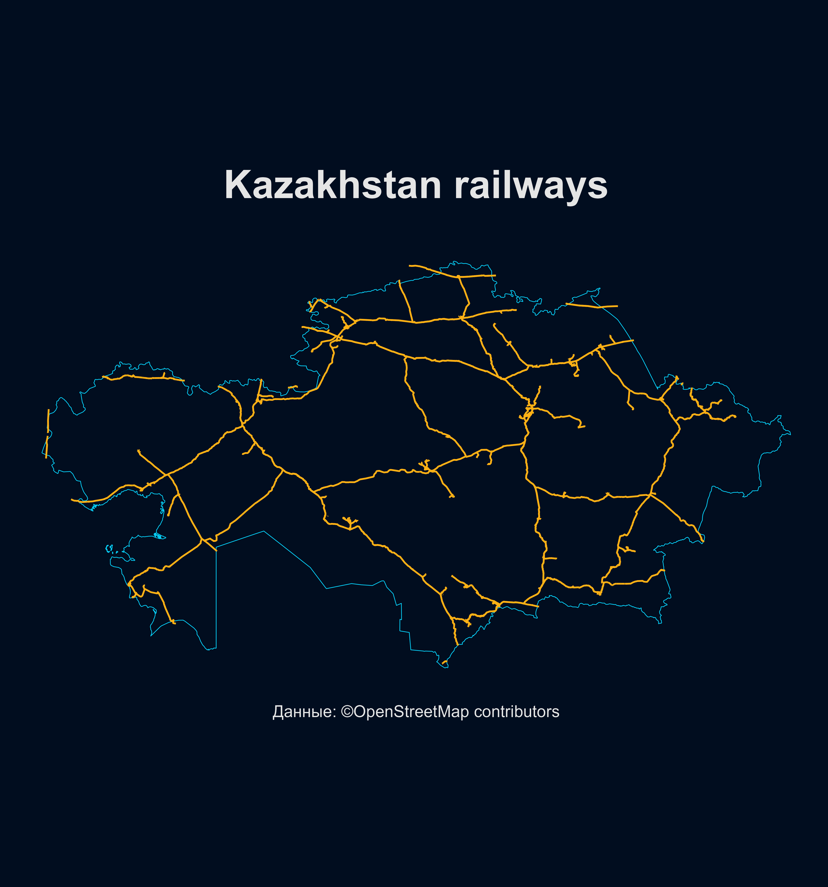

# Kazakhstan-railways

I made a map of the railway network of Kazakhstan 🇰🇿 

I developed this visualization using the R programming language using the libraries: pRecipe, giscoR, terra, tidyverse, rayshader, sf, classInt

Interesting facts about the railways of Kazakhstan

The total length of Kazakhstan's railway network is about 16,614 km, of which 4,200 km are electrified. The entire network is built on a 1,520 mm wide gauge typical of the former Soviet Union.

In 2022, JSC "NC "Kazakhstan Temir Zholy" set a new record for cargo transportation, transporting more than 252 billion ton-kilometers. This is an increase of 5.2% compared to the previous year. Over the past 20 years, the volume of goods transported by KTZ has doubled. The main cargoes are coal, grain and metallurgical products.

Kazakhstan's railways connect the country with Russia, China, Uzbekistan and other neighboring countries. In 2022, cargo turnover between Kazakhstan and China reached 23 million tons, which is 14% more than in 2021. In 2023, Kazakhstan began construction of a third railway link with China, which will increase the capacity to 48 million tons per year.

The international railway corridors of Kazakhstan include:
- The Northern Corridor of the Trans-Asian Railway passing through Dostyk/Altynkol – Moynty – Astana – Petropavlovsk, connecting China and Europe.
 The Central Asian Corridor linking Russia with Central Asia, passing through Saryagash in southern Kazakhstan, Arys and Kandyagash, reaching Ozenka.
- 🌐 The Southern Corridor connecting China and Southeast Asia with Central Asia and the Persian Gulf, passing through Dostyk/Altynkol – Aktogay – Almaty – Arys – Saryagash.
 TRACECA (Europe – Caucasus – Asia Transport Corridor), which includes 13 countries and passes through the western ports of Kazakhstan Aktau and Kuryk.
 The North-South, 7,200-kilometer route connecting Russia with Iran, the Persian Gulf states and India also passes through Kazakhstan.

New infrastructure projects, such as the construction of new railway lines and the modernization of existing ones, are aimed at increasing the country's transit potential. For example, the construction of the Darbaza-Maktaaral railway line will improve communication with Uzbekistan and other countries in the region, as well as facilitate the transportation of goods and passengers.
